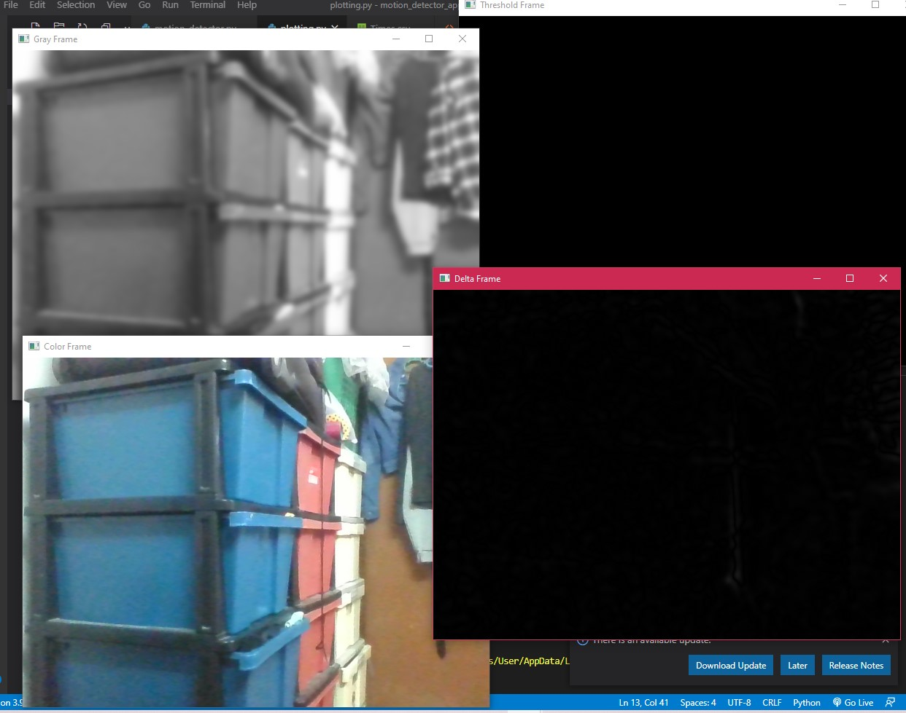
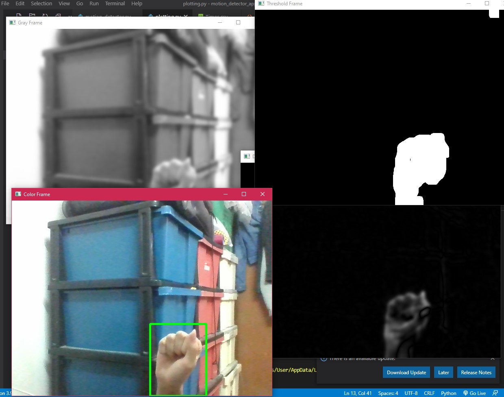
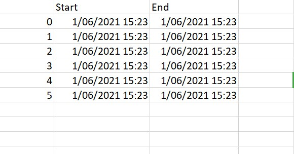
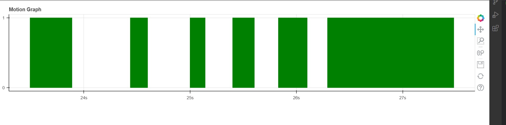

# TABLE OF CONTENT

* [Project description](#project-description)
* [Dependencies](#dependencies)
* [Screenshots](#screenshots)

## Project Description

This project opens webcam and detects motion.

The motions are recorded in a csv file, and a graph is plotted to graph.html.

## Dependencies
- bokeh

## Screenshots

